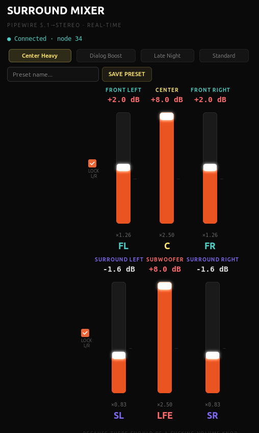

# Surround Mixer

### The volume knob that should have existed.

A real-time PipeWire 5.1→stereo downmix controller for Linux. Gives you per-channel gain sliders — most importantly, a **center channel knob** — so you can actually hear dialog on your shitty soundbar.

  

<!-- screenshot goes here -->
 

## The Problem

You're watching a movie. An explosion happens and your walls shake. Someone says something important and you can't hear a single word. You reach for the center channel knob and — there isn't one.

Every AV receiver since the 1970s has had one. Every soundbar either buries it in some proprietary app or doesn't have it at all. Linux doesn't touch it because it assumes you have a proper receiver with physical knobs.

If you have a soundbar, a pair of desktop speakers, or headphones, and you watch anything with a 5.1 surround mix, you have experienced this problem. I was unable to find a solution on Linux, until now.

## The Origin Story

This app exists because I don't know Python.

What happened was: I was trying to watch The Expanse on Ubuntu with a soundbar and couldn't hear dialog over the engine rumble of the Rocinante. I complained to Claude (Anthropic's AI) about the fact that there's no center channel volume knob anywhere in the Linux audio stack. Claude agreed this was genuinely insane, because LLMs are very agreeable. One conversation later, we had a working PipeWire filter-chain config. Two hours after that, we had a GTK4 app with real-time sliders that poke PipeWire's running audio graph without restarting anything.

Apparently PipeWire's filter-chain architecture is actually really well-engineered — it was just missing the UI on top, or at least I couldn't find any.

Built with [Claude](https://claude.ai) by Anthropic. Human provided anger. Claude provided code.

## What It Does

Surround Mixer creates a virtual PipeWire audio sink that:

1. Accepts 5.1 surround input (FL, FR, Center, LFE, SL, SR)
2. Lets you set the gain on each channel independently
3. Mixes it down to stereo for your output device
4. Does this in real-time — drag a slider while audio is playing and hear the change instantly

The center channel (where dialog lives) gets mixed into both left and right outputs. Crank its gain above the others and suddenly you can hear people talk.

## Install

### Requirements

- Ubuntu 22.04+ (or any Linux with PipeWire)
- Python 3.10+
- GTK4

### Quick Start

```bash
# Install dependencies
sudo apt install python3-gi gir1.2-gtk-4.0 pipewire pipewire-pulse wireplumber

# Make sure PipeWire is your audio server (not PulseAudio)
# If `pw-cli info 0` returns something, you're good.
# If not:
systemctl --user --now disable pulseaudio.service pulseaudio.socket
systemctl --user --now enable pipewire pipewire-pulse wireplumber
# Log out and back in

# Download and run
chmod +x surround_mixer.py
./surround_mixer.py
```

On first launch, the app will show an "INSTALL & RESTART PIPEWIRE" button. Click it. This writes the PipeWire filter-chain config and restarts PipeWire. After that, you'll see "Surround Mixer" as an audio output device in your system sound settings.

### Desktop Integration

Run `install.sh` to get a proper app launcher with an icon:

```bash
chmod +x install.sh
./install.sh
```

Then search "Surround Mixer" in your app menu.

### VLC Setup

VLC needs to send 5.1 audio to PipeWire instead of downmixing internally:

1. Open VLC → Tools → Preferences → Audio 
2. Click "All" at the bottom left (show advanced settings)
3. Audio → set "Stereo audio output mode" to **Unset**
4. Audio → Output modules → set to **PulseAudio audio output**
5. Save and restart VLC
6. While playing, open `pavucontrol` and route VLC to **Surround Mixer**

VLC remembers the routing, so you only do this once. Once it is working use Timeshift to back up your shit so you never have to do this again.

## Usage

**Sliders:** Drag to adjust gain per channel. 0 dB (×1.00) is unity gain. The tick mark on each slider shows 0 dB.

**L/R Lock:** Checkboxes on the left lock front L/R and rear L/R together. On by default. Uncheck to adjust left and right independently.

**Presets:** Click to apply. Ships with five starting presets. All presets are editable.

**Save Preset:** Type a name and click SAVE PRESET (or hit Enter). Saves current slider positions as a new preset. If the name matches an existing preset, it overwrites.

**Recommended starting point:** Click "Dialog Boost" and adjust from there.

## Presets

Presets are individual JSON files in `~/.config/surround-mixer/presets/`:

```
~/.config/surround-mixer/presets/
  Dialog Boost.json
  Late Night.json
  ...
```

Each file is just the six gain values:

```json
{"fl": 0.8, "fc": 1.5, "fr": 0.8, "sl": 0.4, "lfe": 0.5, "sr": 0.4}
```

Any new presets you make you can delete by deleting the file.

## How It Works

Under the hood, Surround Mixer uses PipeWire's `libpipewire-module-filter-chain` to create a virtual audio sink with two `mixer` builtin nodes — one for the left output, one for the right. Each mixer takes four inputs (front, center, surround, and LFE for its side) with independent gain controls.

When you drag a slider, the app calls `pw-cli set-param` on the running filter-chain node to update the gain in real-time. The PipeWire config file is also silently updated in the background so your settings survive reboots.

```
5.1 Input              Mixers                                     Output
─────────              ──────                                     ──────

FL  ───────────────→ ┐
FC  ───────────────→ ┤ mixL (FL×g + FC×g + SL×g + LFE×g) ──────→ Left
SL  ───────────────→ ┤
LFE ───────────────→ ┘

FR  ───────────────→ ┐
FC  ───────────────→ ┤ mixR (FR×g + FC×g + SR×g + LFE×g) ──────→ Right
SR  ───────────────→ ┤
LFE ───────────────→ ┘
```

## Troubleshooting

**"Mixer sink not loaded"** — Click INSTALL & RESTART PIPEWIRE. If that doesn't work, check `journalctl --user -u pipewire -n 30` for errors.

**No audio after restart** — PipeWire restart can disconnect active streams. Restart your media player.

**Dialog still quiet** — Make sure VLC is outputting 5.1, not downmixing to stereo internally. Check VLC's "Stereo audio output mode" is set to "Unset". Also make sure VLC is routed to "Surround Mixer" in pavucontrol, not directly to your soundbar.

**Distortion on loud scenes** — In theory, gains above 1.0 can clip. Lower the center gain or reduce all other channels proportionally. 

**Works with other players?** — Anything that outputs 5.1 via PipeWire/PulseAudio *should* work. Route it to the Surround Mixer sink in pavucontrol. I've only tested it with VLC.

## Contributing

This started as one person yelling at a soundbar. PRs welcome. Especially interested in:

- Flatpak / Snap packaging
- System tray integration with a quick center-channel slider
- Per-application routing (auto-route media players to the mixer)
- A way to detect whether the source is actually sending 5.1 vs stereo
- A human who actually knows python because this code was spit out by Claude so I would stop complaining about it

## License

MIT. Do whatever you want with it. Just make dialog audible.
